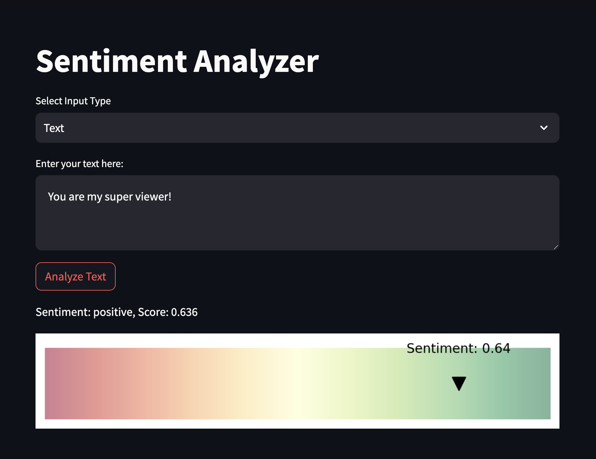

# Sentiment Analyzer App



This is a simple Sentiment Analyzer app built with Streamlit and Python. The app allows users to analyze the sentiment of text or audio input.

Demo: https://sentiment-analyzer--poornima-28.repl.co/

## Features

- Sentiment analysis of text input using VADER Sentiment Analyzer.
- Speech-to-text conversion for audio input and subsequent sentiment analysis.
- Custom visualization of sentiment scores on a gradient scale from red to green, with the sentiment score represented as a black triangle marker.
- Deployment on Streamlit.

## How to Use

1. Clone the repository to your local machine:

```bash
git clone https://github.com/your-username/sentiment-analyzer-app.git
cd sentiment-analyzer-app
```

2. Install the required Python packages:

```bash
pip install -r requirements.txt
```

3. Run the app

```bash
streamlit run app.py
```

Access the app in your web browser at http://localhost:8501.

Select the input type (Text or Audio) and provide the necessary input.

For Text input, enter your text in the text area and click "Analyze Text."
For Audio input, upload an audio file (supported formats: WAV, MP3, M4A) and click "Analyze Audio."
Dependencies
The app relies on the following Python packages:

streamlit,
librosa,
numpy,
matplotlib,
speech_recognition,
vaderSentiment,
tempfile,
soundfile,
pydub,
These packages are listed in the requirements.txt file.

Notes
The sentiment analysis for audio input is performed using VADER Sentiment Analyzer after converting the audio to text using the Google Web Speech API (requires an internet connection for speech recognition).
The app was developed for educational and demonstration purposes and may not be suitable for production use.
